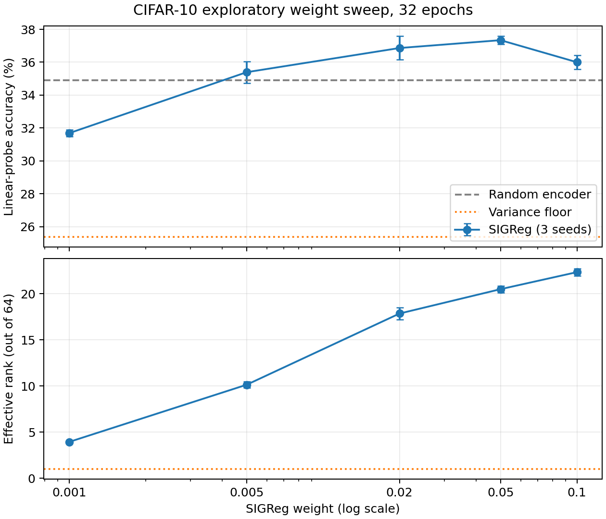

# CIFAR-10 SIGReg transfer experiment

The previous synthetic study found SIGReg weight `0.005` effective for an
8-dimensional dynamical system. This experiment tests whether that result
transfers to a small 64-dimensional JEPA-style image encoder trained on
[CIFAR-10](https://cave.cs.toronto.edu/kriz/cifar.html). The encoder predicts
between two independently augmented views of the same image. Class labels are
never used in representation training; a frozen linear probe is fitted on the
official training split and scored on the official test split.

| Epochs | Objective | Weight | Test probe accuracy (%) | Effective rank / 64 | Min. coordinate std |
|---:|---|---:|---:|---:|---:|
| 8 | Random encoder | — | 34.92 ± 0.43 | 3.10 | 0.0005 |
| 8 | Prediction only | — | 24.06 ± 1.61 | 48.27* | 0.0001 |
| 8 | Variance floors | 4 | 23.79 ± 0.98 | 1.00 | 1.4998 |
| 8 | SIGReg | 0.005 | 34.03 ± 0.91 | 4.93 | 0.4445 |
| 32 | Variance floors | 4 | 25.38 ± 1.44 | 1.00 | 1.1435 |
| 32 | SIGReg | 0.001 | 31.69 ± 0.21 | 3.95 | 0.2955 |
| 32 | SIGReg | 0.005 | 35.39 ± 0.66 | 10.14 | 0.5503 |
| 32 | SIGReg | 0.02 | 36.86 ± 0.72 | 17.86 | 0.6472 |
| 32 | SIGReg | 0.05 | **37.34 ± 0.24** | 20.50 | 0.7394 |
| 32 | SIGReg | 0.1 | 36.00 ± 0.43 | 22.35 | 0.7770 |

Entries show mean ± sample standard deviation across seeds 0, 1, and 2.
`*` Prediction-only has tiny variance in every coordinate: its high normalized
effective rank describes only the relative shape of that small signal and
cannot establish that the representation avoided collapse.



## Interpretation

- The synthetic-study weight `0.005` prevented the severe rank-one outcome of
  the variance-floor baseline, but after eight epochs its classification score
  did not exceed the untrained random encoder. A working anti-collapse loss
  alone did not guarantee semantic features.
- Longer training and stronger SIGReg weights increased effective rank and
  classification accuracy. Among the tested 32-epoch settings, `0.05` had the
  highest measured accuracy. The gain is `+2.42` percentage points over the
  untrained encoder and `+11.96` points over the 32-epoch variance-floor
  baseline. At `0.1`, rank rose further but accuracy fell, so geometry and
  downstream quality should be assessed together.
- The variance-floor baseline maintained per-coordinate standard deviations
  above one while its effective rank stayed near one, even after 32 epochs.
  This reproduces correlated dimensional collapse on real images.

## Limits of the claim

This is an **exploratory** weight sweep: test-set probe accuracy was inspected
while selecting additional SIGReg weights. The `37.34%` figure is therefore
not an unbiased held-out estimate for a tuned method. A fresh validation/test
protocol or a different dataset is required to confirm the selected weight.
The small encoder, eight or 32 training epochs, mild crop/flip/brightness
augmentations, and shared online/target weights limit what can be inferred
about larger JEPA systems. No claim of competitive CIFAR-10 accuracy is made.

The linear probe uses all 50,000 training labels after representation learning
and is evaluated on 10,000 official test examples. Ridge strength and feature
standardization are fixed across variants. The released JSON files contain
per-seed metrics, training history, exact hyperparameters, dataset checksum,
and software versions.

## Reproduction and cost

```bash
PYTHONPATH=jepa-anything-core/src python3 recipes/sigreg-cifar10/train.py \
  --device cuda \
  --download-url https://data.brainchip.com/dataset-mirror/cifar10/cifar-10-binary.tar.gz \
  --output-dir results/runpod-cifar10-2026-09-25
```

For the 32-epoch runs, set `--epochs 32`, `--variants variance,sigreg`, and
the reported `--sigreg-weight` as appropriate; see each `results.json` for
the full invocation settings. Plot with
`python recipes/sigreg-cifar10/plot.py --result-dir results/runpod-cifar10-2026-09-25`
after installing Matplotlib.

The archive downloaded from the mirror matched the dataset publisher's MD5
`c32a1d4ab5d03f1284b67883e8d87530`. The GPU was an NVIDIA RTX PRO 4000
Blackwell with PyTorch 2.8.0+cu128. The Runpod balance changed from
`$45.8881071921` to `$45.5388810542`, a measured cost of `$0.3492261379`
including download and startup. The experiment Pod was deleted and the
post-run spend rate was `$0/hour`.
